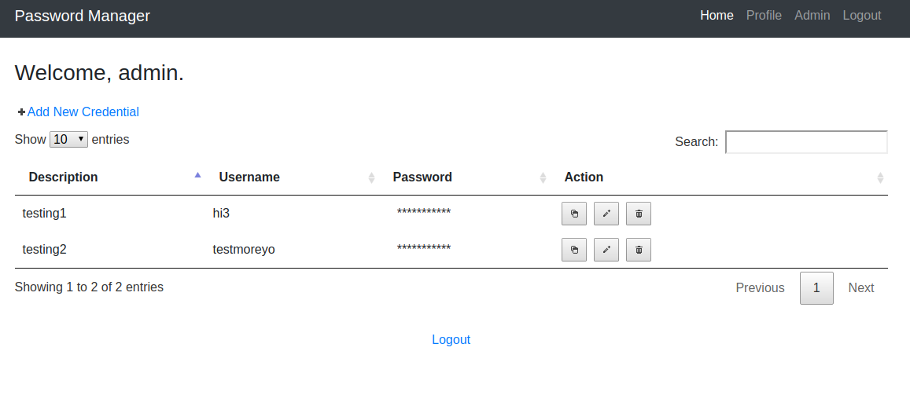

# Flask App for Password Management

An application for storing user credentials for accessing different applicatiions. 
Containerized and can run using Docker or on AWS ECS.

### Tech Stack / Dependencies
- Flask python 2.7
- JQuery 3.4.1
- JQuery UI
- Bootsrap 4
- SQLite with sqlalchemy
- Docker

#### How to Run
Change to the parent directory of project/
> ./setup.sh

### Preview
- Sign up Page
    
- Login page
    
- Admin Page
  
- Encrypted stored password
    

#### How To Use

Sign up & Login to main page 

@profile

Desktop version
-  Double click on Description and Username to edit them 

Mobile version
- Hold on Description and Username to edit them
